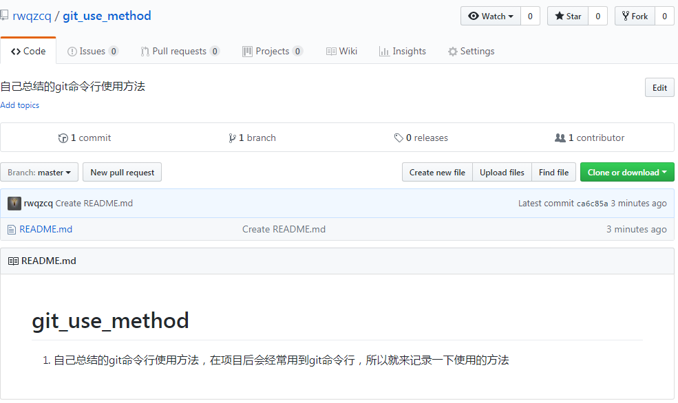
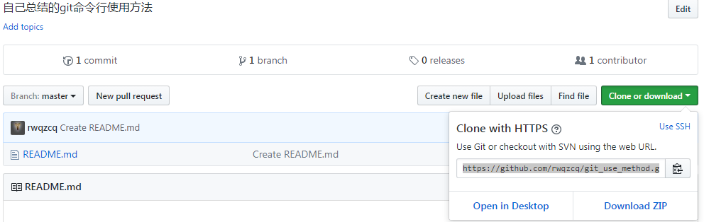
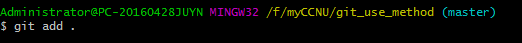
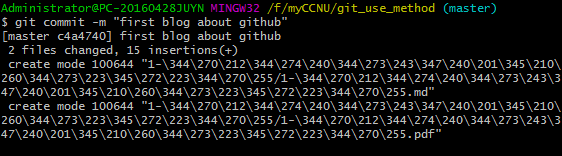
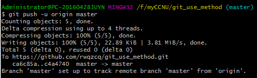
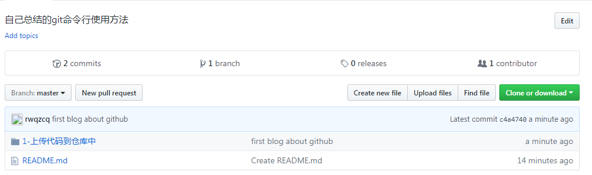

### 上传代码到仓库中
1. 在自己的github上新建一个仓库
    
2. 在本地的一个文件夹右击`Git Bush Here`
3. 在命令行中输入下面的句子来把github仓库里面的代码拷贝到本地
    ```
    git clone https://github.com/rwqzcq/git_use_method.git
    ```
    这时候你的文件夹之下就会有一个以你的仓库命名的文件夹
    
3. 然后你就可以在从服务器克隆到本地的文件夹之下编辑文件了
4. 点击刚刚克隆好的文件夹,右击`Git Bush Here`
5. 在命令行中输入下面的句子把你编辑好的文件先`暂存到本地`
    ```
    git add . 
    ```
    
6. 接着输入下面的句子来为你即将开始的提交代码的工作写上备注
    ```
    git commit -m "提交信息"
    ```
    
7. 输入下面的句子完成最后的提交工作（很激动有木有）
    ```
    git push -u origin master
    ```
    
8. 最后你就可以在网页上看到自己提交的代码了
